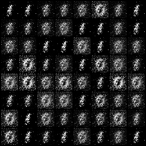
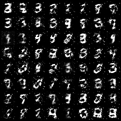
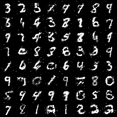
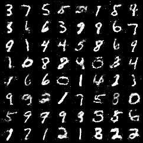
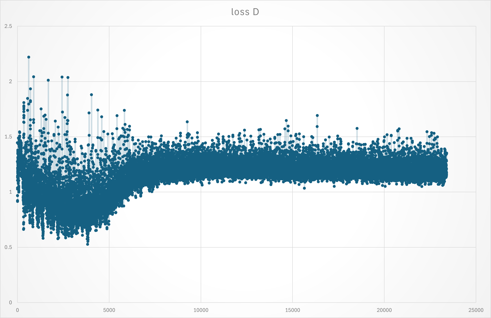
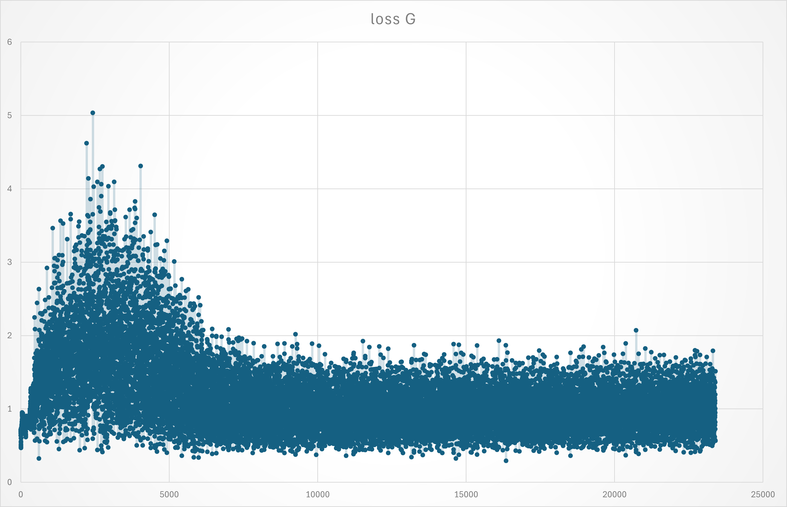

# SimpleGAN
Simplest GAN - easy learning GAN by this simple code - Dataset: MNIST - Fully Connected Generator and Discriminator

## Results

|  |  |
|:--:|:--:|
| Epoch 1 | Epoch 10 |
|  |  |
| Epoch 20 | Epoch 50 |

## Loss Generator & Discriminator

